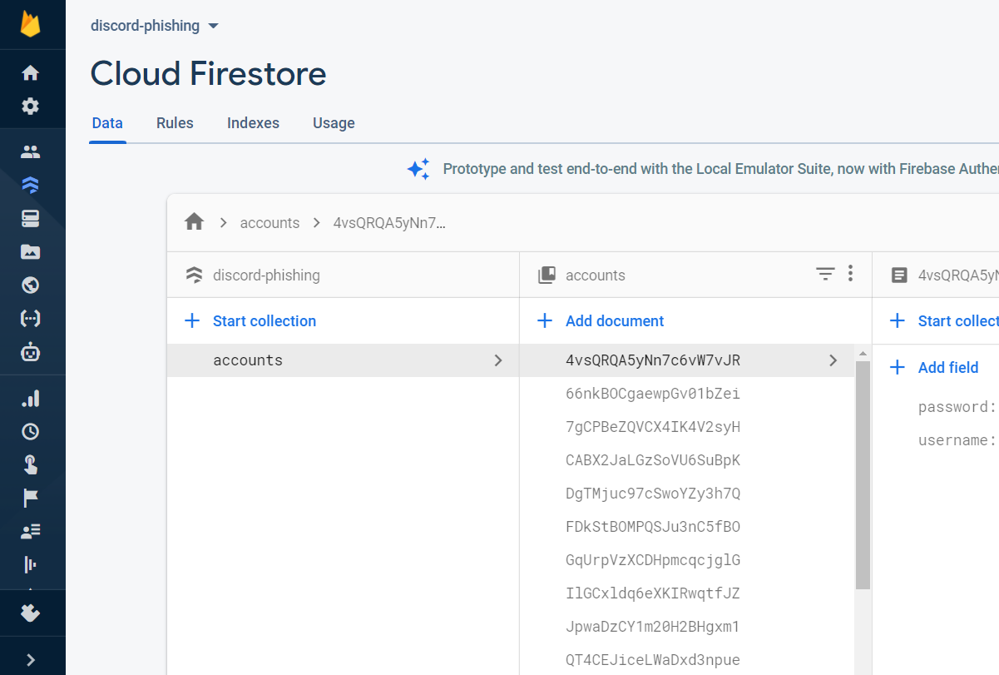
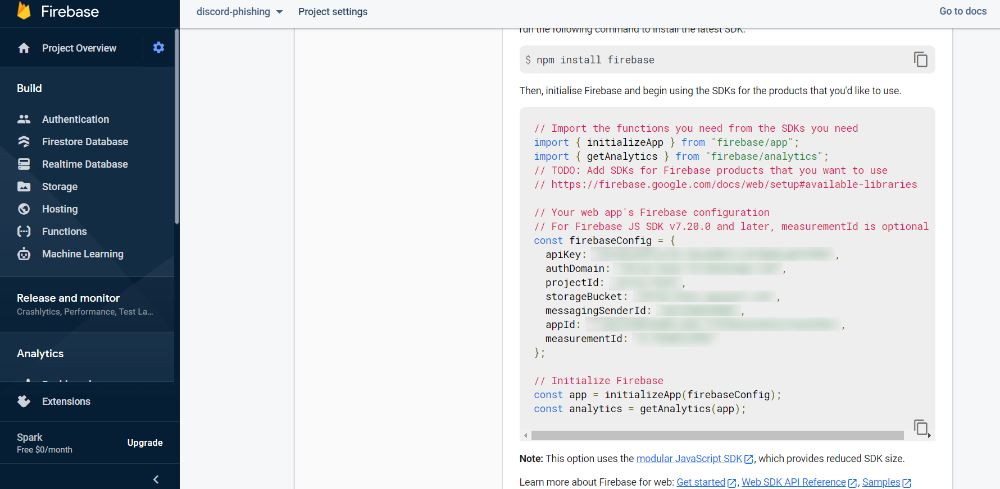
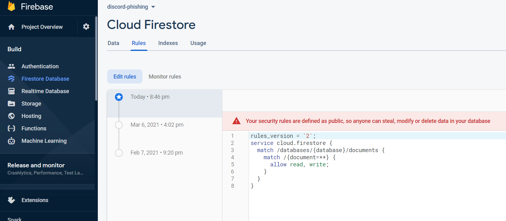

## An educational Discord Login Phishing Tool
Credit to https://github.com/snimmagadda1/discord-login-clone for most of the the React Discord login creation.

This is a very basic yet powerful phishing website that is connected to a Google Firebase database. Once the user logs in, it will redirect 
to one of Discord's authentication pages to ensure credibility. Please use this with caution as stealing people's passwords is a crime.


## How to Setup (Step by Step)

1. Start off by cloning this project on your local machine:
```
git clone https://github.com/fairnightzz/Discord-Login-Phishing.git
```

2. Download ZIP if you don't have the Git cli installed.

3. Open the folder in VSCode or some terminal

4. In the terminal at the root directory of the project, run `npm install`. This will install all the project's dependencies. Make sure to have `npm` (node package manager) installed in some way. 

5. In order to save the Discord form information, `DiscordForm.js` file, we must have a Firebase config. Hence you will need a `firebase.js` file - simply fill in the information that Firebase needs in order to upload the information. Don't know how to set up firebase? Go to [here.](firebase.google.com)

6. To use firebase, create an account, a new project, and make a new database in Firestore. Make a collection called `accounts`



This is the overall structure of how your data will be stored.

7. The config is stored in the project settings, here:



8. Last step in firebase - for now, we will give read/write access to anyone for the sake of development. Under the Rules tab, allow read/write access:


9. Lastly, go back to your project and run `npm start`. When you click login, it will redirect to one of Discord's links. 


## Built with

- [React](https://reactjs.org/)
- [cra](https://reactjs.org/docs/create-a-new-react-app.html)
- [styled-components](https://styled-components.com/)
- [bit.dev](https://bit.dev)
